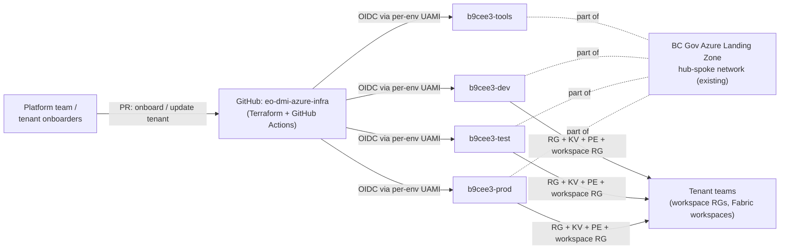
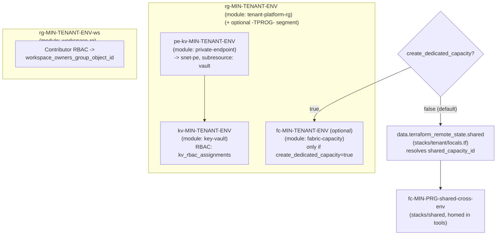
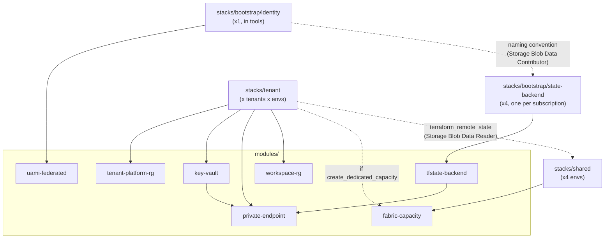
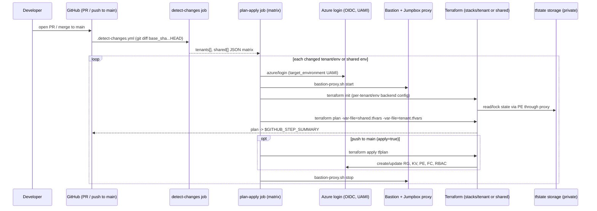

# Architecture

This diagram set describes the current state of `eo-dmi-azure-infra`: a
Terraform + GitHub Actions repo that layers per-tenant Fabric platform
resources onto BC Gov's existing Azure Landing Zone (ALZ) network. The
hub-spoke network, VNets/subnets, peering, and the Bastion/jumpbox are **not**
created by this repo - they're referenced via
`params/global/network-reference.yaml` and
[bcgov/eo-dmi-alz-bastion-jumpbox](https://github.com/bcgov/eo-dmi-alz-bastion-jumpbox).

`TENANT` and `ENV` below are placeholders for an onboarded tenant name
(e.g. `pmt`) and environment (`dev` | `test` | `prod`). `MIN` and `PRG`
are placeholders for `ministry_code` and `program_code` (e.g. `citz` /
`pmt`), used for **platform-level** resources. Tenant-owned resources use a
different convention - `MIN`-`TENANT`-`[TPROG-]`-`ENV` - where `TENANT`
occupies the "program" position and `TPROG` is the tenant's optional
sub-program (`tenant_program_name`). See
[docs/platform-guide.md "Naming conventions"](platform-guide.md#6-naming-conventions)
for the full standard.

---

## 1. System context

---

## 2. Subscription & network topology

```mermaid
flowchart TB
    HUB["Hub VNet (existing ALZ)\nhub-spoke routing only"]

    subgraph TOOLS["Subscription: b9cee3-tools"]
        direction TB
        subgraph TOOLS_SPOKE["Spoke VNet (existing)"]
            BASTION["Azure Bastion\n(AzureBastionSubnet)"]
            TOOLS_PE_SUBNET["snet-pe"]
            JUMPBOX["Jumpbox VM\n(eo-dmi-alz-bastion-jumpbox)"]
        end
        RG_IDENTITY["rg-MIN-PRG-identity\nuami-MIN-PRG-tools/dev/test/prod"]
        RG_TFSTATE_TOOLS["rg-MIN-PRG-tfstate-tools\nstMINPRGtoolstfstate"]
        RG_SHARED_TOOLS["rg-MIN-PRG-shared-tools\nfc-MIN-PRG-shared-cross-env (F64)"]
    end

    subgraph DEV["Subscription: b9cee3-dev"]
        direction TB
        subgraph DEV_SPOKE["Spoke VNet (existing)"]
            DEV_PE_SUBNET["snet-pe"]
        end
        RG_TFSTATE_DEV["rg-MIN-PRG-tfstate-dev\nstMINPRGdevtfstate"]
        RG_TENANTS_DEV["rg-MIN-TENANT-dev\nrg-MIN-TENANT-dev-ws\n(repeated per tenant)"]
    end

    subgraph TEST["Subscription: b9cee3-test"]
        direction TB
        subgraph TEST_SPOKE["Spoke VNet (existing)"]
            TEST_PE_SUBNET["snet-pe"]
        end
        RG_TFSTATE_TEST["rg-MIN-PRG-tfstate-test\nstMINPRGtesttfstate"]
        RG_TENANTS_TEST["rg-MIN-TENANT-test\nrg-MIN-TENANT-test-ws\n(repeated per tenant)"]
    end

    subgraph PROD["Subscription: b9cee3-prod"]
        direction TB
        subgraph PROD_SPOKE["Spoke VNet (existing)"]
            PROD_PE_SUBNET["snet-pe"]
        end
        RG_TFSTATE_PROD["rg-MIN-PRG-tfstate-prod\nstMINPRGprodtfstate"]
        RG_TENANTS_PROD["rg-MIN-TENANT-prod\nrg-MIN-TENANT-prod-ws\n(repeated per tenant)"]
    end

    HUB -- peering --- TOOLS_SPOKE
    HUB -- peering --- DEV_SPOKE
    HUB -- peering --- TEST_SPOKE
    HUB -- peering --- PROD_SPOKE

    BASTION --> JUMPBOX
    JUMPBOX -. SOCKS5 proxy, CI only .-> TOOLS_PE_SUBNET
    JUMPBOX -. SOCKS5 proxy, CI only .-> DEV_PE_SUBNET
    JUMPBOX -. SOCKS5 proxy, CI only .-> TEST_PE_SUBNET
    JUMPBOX -. SOCKS5 proxy, CI only .-> PROD_PE_SUBNET

    RG_TFSTATE_TOOLS -. PE .-> TOOLS_PE_SUBNET
    RG_TFSTATE_DEV -. PE .-> DEV_PE_SUBNET
    RG_TFSTATE_TEST -. PE .-> TEST_PE_SUBNET
    RG_TFSTATE_PROD -. PE .-> PROD_PE_SUBNET

    RG_TENANTS_DEV -. PE for KV .-> DEV_PE_SUBNET
    RG_TENANTS_TEST -. PE for KV .-> TEST_PE_SUBNET
    RG_TENANTS_PROD -. PE for KV .-> PROD_PE_SUBNET
```

Notes:
- Azure Bastion and the jumpbox VM are both in the **tools subscription**
  (`eo-dmi-alz-bastion-jumpbox-tools` resource group), managed by
  `bcgov/eo-dmi-alz-bastion-jumpbox`. Bastion sits in `AzureBastionSubnet`
  of the tools spoke VNet; the hub VNet provides peering between spokes but
  does not host the Bastion.
- `rg-MIN-PRG-shared-<env>` is only created in environments that have entries
  in `params/global/fabric-capacities.yaml` with that `home_env`. Today only
  `tools` has one (`shared-cross-env`); dev/test/prod equivalents are
  commented-out examples.
- All private endpoints land in each environment's existing `snet-pe`, per
  `params/global/network-reference.yaml`.

---

## 3. Tenant resource pattern (per tenant, per environment)

Inputs come from `params/<env>/shared.tfvars` (shared per-env values:
subscription, PE subnet, DNS zones, AAD tenant) plus
`params/<env>/tenants/<tenant>/tenant.tfvars` (tenant-specific: owners group,
KV RBAC, capacity choice).

---

## 4. Bootstrap identity & RBAC (`stacks/bootstrap/identity`)

```mermaid
flowchart TB
    GH["GitHub Actions (OIDC)"]

    subgraph RG_IDENTITY["rg-MIN-PRG-identity (in tools)"]
        U_TOOLS["uami-MIN-PRG-tools"]
        U_DEV["uami-MIN-PRG-dev"]
        U_TEST["uami-MIN-PRG-test"]
        U_PROD["uami-MIN-PRG-prod"]
    end

    GH -- federated credential --> U_TOOLS
    GH -- federated credential --> U_DEV
    GH -- federated credential --> U_TEST
    GH -- federated credential --> U_PROD

    U_TOOLS -- "Contributor +\nRBAC Admin" --> SUB_TOOLS["Subscription: tools"]
    U_DEV -- "Contributor +\nRBAC Admin" --> SUB_DEV["Subscription: dev"]
    U_TEST -- "Contributor +\nRBAC Admin" --> SUB_TEST["Subscription: test"]
    U_PROD -- "Contributor +\nRBAC Admin" --> SUB_PROD["Subscription: prod"]

    U_TOOLS -- "Storage Blob\nData Contributor" --> ST_TOOLS["stMINPRGtoolstfstate"]
    U_DEV -- "Storage Blob\nData Contributor" --> ST_DEV["stMINPRGdevtfstate"]
    U_TEST -- "Storage Blob\nData Contributor" --> ST_TEST["stMINPRGtesttfstate"]
    U_PROD -- "Storage Blob\nData Contributor" --> ST_PROD["stMINPRGprodtfstate"]

    U_DEV -. "Storage Blob\nData Reader" .-> ST_TOOLS
    U_TEST -. "Storage Blob\nData Reader" .-> ST_TOOLS
    U_PROD -. "Storage Blob\nData Reader" .-> ST_TOOLS

    U_TOOLS -- Reader --> BASTION["Bastion (tools)"]
    U_DEV -- Reader --> BASTION
    U_TEST -- Reader --> BASTION
    U_PROD -- Reader --> BASTION

    U_TOOLS -- "VM User Login" --> JUMPBOX["Jumpbox VM (tools)"]
    U_DEV -- "VM User Login" --> JUMPBOX
    U_TEST -- "VM User Login" --> JUMPBOX
    U_PROD -- "VM User Login" --> JUMPBOX
```

The dotted `Storage Blob Data Reader` edges are what let a dev/test/prod
`stacks/tenant` apply read tools' `stacks/shared` state to resolve
`fc-MIN-PRG-shared-cross-env`'s resource ID (see diagram 3, "REMOTE").

---

## 5. Terraform module & stack dependencies

---

## 6. CI/CD pipeline flow

`pr-validate.yml` runs the loop with `apply: false`; `deploy.yml` runs it with
`apply: true`. `test`/`prod` GitHub Environments with required reviewers pause
the matrix job before `terraform apply` runs.
